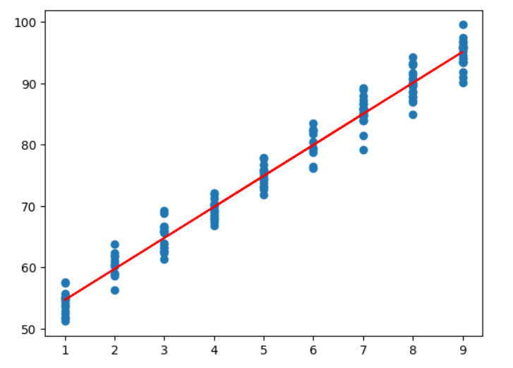

**🔎 Introduction**
This project demonstrates how Linear Regression can be applied to multiple real-world datasets to uncover meaningful relationships.
By fitting straight-line models, we can predict outcomes such as exam scores, salaries, house prices, and sales from relevant input variables.

**📂 Data Sources**

The analysis covers multiple datasets with ~150 records each:

Study Hours & Scores → relationship between study time and academic performance
Experience & Salary → effect of work experience on earnings
House Size & Price → estimating house prices from property size
House Price (Multi-feature) → price predictions using multiple housing features
Advertising & Sales → influence of ad spending across media platforms

**📊 Key Visuals**
**STUDY HOURS & SCORES**

**💡 Insights**

📚 More study hours generally improve exam performance.
💼 Work experience strongly impacts salary growth.
🏠 House prices increase with property size; multi-feature models capture more accuracy.
📢 Advertising through TV and radio shows stronger sales impact compared to newspapers.

